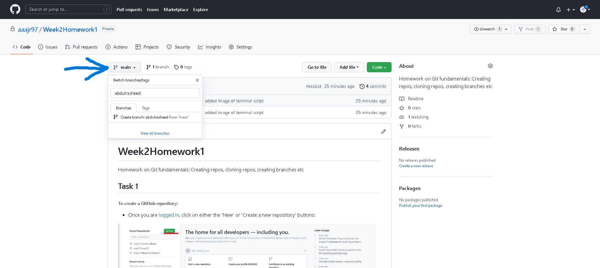
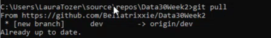
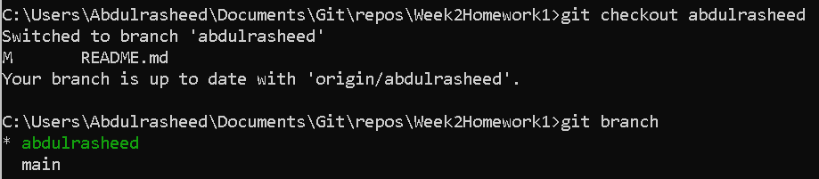
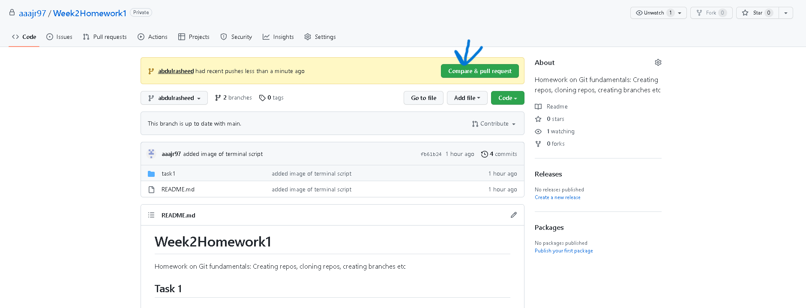
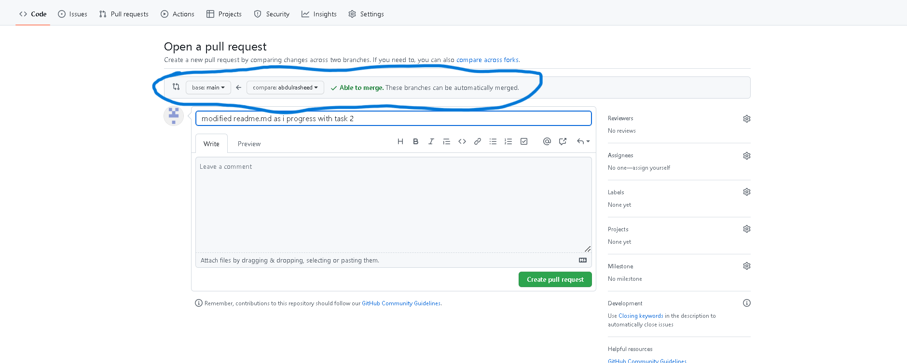
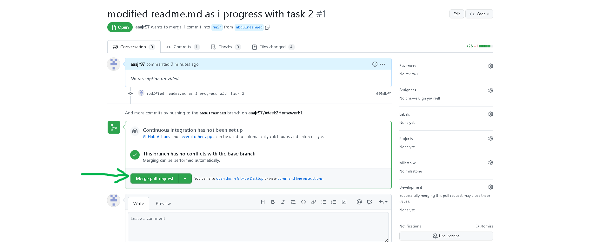
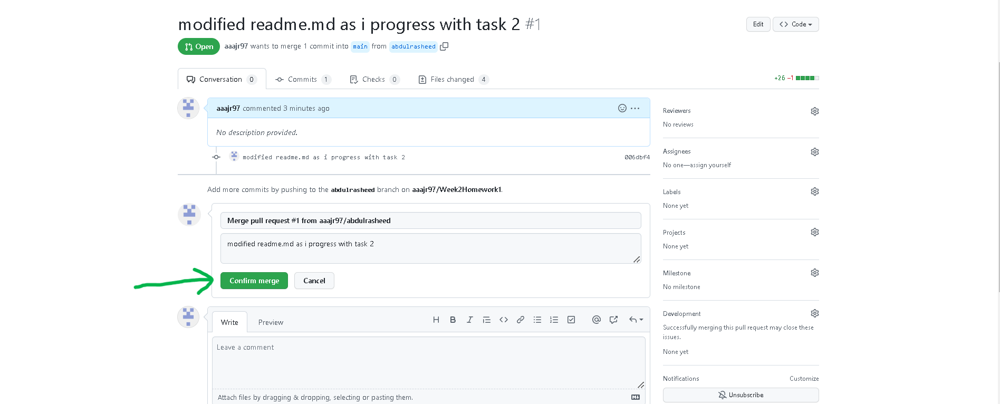
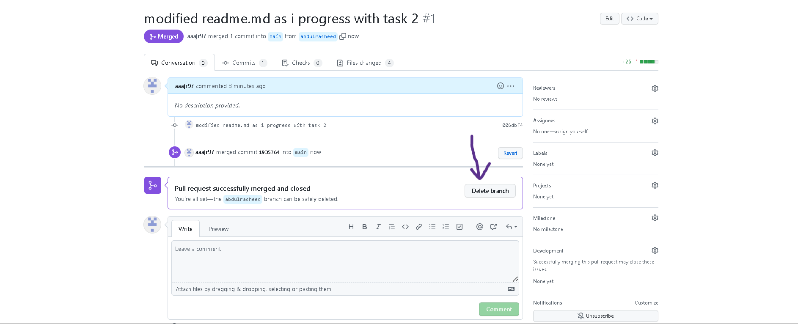

# __Week2Homework1__
Homework on Git fundamentals: Creating repos, cloning repos, creating branches etc  

## __Task 1 (creating, cloning and pushing repo)__  
###### To create a GitHub repository:

- Once you are [logged in](github.com), click on either the 'New' or 'Create a new repository' buttons:  
>  

- On the following page, you can customise the repository to your preference.   
>

- After filling in the required details, click on the 'Create repository' button and you have successfully created a repository!

###### To clone a repository to a local machine:
- Copy the repo URL by clicking the 'Code' button and clicking the copy widget at the side of the URL displayed:  
>  

- On the local machine, run command prompt, and change directory to a destination where the repository would be cloned by entering the following syntax:  
>```cd C:\Users\Username\filepath```

- Clone the repository to your preferred folder destination by entering the following command into command prompt:  
>```git clone https://github.com/githubusername/reponame.git```

- You should now have successfully cloned your repository from the remote server to your local machine

___A folder named after the repository name you chose will be created; you can browse that folder using file explorer, and make changes to the repository locally, such as changing the readme file___  

__Pushing local repository back into Github:__  
- After making said changes locally, access the repository using Git Bash by browsing to the repository on your local machine, right-clicking on any white space and clicking on the 'Git Bash Here' option:  
>  

- You can check the status of your repository by entering the following command on Git Bash: ```git status```. The terminal should return a script looking like this:  
>  *As you can see, the red text indicates that changes have been made, but are not ready to be added into the remote repository*

- To make the changes ready, enter the following syntax ```git add . ``` If you run the status command again, the script will state that any modified changes are good to go and can be added into the remote repository:
> *The modified changes are now in what is called the staging area, and are ready to be committed*

- To commit the changes, enter the following command: ```git commit -m "Insert commit message"```. *(The ```-m``` command allows you to input a message into said commit, and is good business practice, so that other users can see and understand any changes that have been made)*.  
> *The modified changes are now committed and can be pushed onto the remote repository*

- __FINAL STAGE.__ To push the changes, enter the following command ```git push```. If the operation is successful, the terminal should return a script that looks like this:  
>  

- __BRAVA! YOU HAVE SUCCESSFULLY PUSHED YOUR LOCALLY MODIFIED CHANGES INTO THE REMOTE REPOSITORY!.__ You can now view the changes by visiting the repo URL on your internet browser.

---  
## __Task 2 (creating and merging branches)__  
__Branches are useful in instances where multiple people are working on the same main branch. It is better for each user their work into different branches so that any work modified within those branches can be checked thoroughly before merging it into the main branch.__  
###### To create a branch from the remote repository:  
- On the repo website, click on main, and type in whatever you would like your branch to be called. Click on the 'create branch: branchname' option to create the branch:  
>  

###### Accessing the branch from the local repository:  
- To access the branch from the local repository, open command prompt, enter the following command ```cd C:\Users\Username\filepath``` to access your repository  

- Since you have made some changes in the remote repository (by adding a branch), you have to __pull__ in those changes from the remore repository back to your local machine. You do this by entering the following command: ```git pull```. The terminal should return the following script:  
> *The script shows the changes that have been pulled, the new branch*

- Now, you can switch from your main branch to the one you created by entering the following command ```git checkout branch_name```. Afterwards, type ```git branch``` to see which branch is currently selected. The following script should be returned:  
> *This shows that the new branch has been selected*  

###### Making changes and pushing back to remote repository

- Enter the filetype you now want to edit. For example, if it is the readme file you want to edit, type ```readme.md```  

- After making your changes, you can then add, commit and push your modified changes back into the GitHub remote repository using the same process as described in Task 1  

###### Granting pull requests  
- After pushing the modifications into the remote repository, a notification should appear on the repo website, informing users that changes have been pushed into a feature branch. To compare and decide whether to pull the changes into the main branch, click on the 'Compare & pull request' option:  
>  

- On the following page, scroll down and you can compare the changes that have been made. If there are no conflicts with the previous version, green text at the top should say 'Able to merge', accompanied by a tick.  
> *Also within the highlighted circle are dropdown menus allowing you to choose the base branch in which you want the merging to occur in*  

- Click on 'Create pull request'  

- __FINAL STAGE!__ On the following pages, click on 'Merge pull request' and 'Confirm merge' if you are happy with the changes:  
>

 >  

- __HURRAH!__ You have successfully merged modifications from a feature branch into a main branch. You are given the option to delete the feature branch by clicking the 'delete branch' button:  
>  

- You can also delete the feature branch locally, by going back to the command prompt and entering the following command ```git branch -d branch_name```

# __HOMEWORK COMPLETE__
