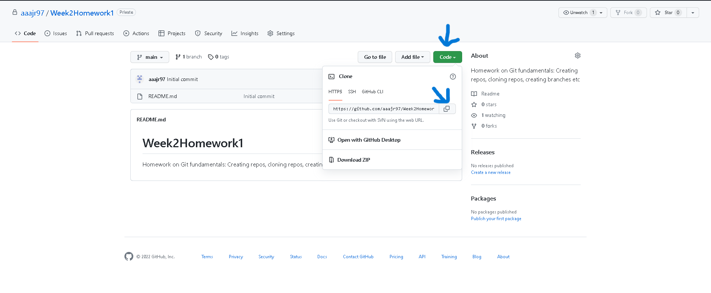

# __Week2Homework1__
Homework on Git fundamentals: Creating repos, cloning repos, creating branches etc  

## __Task 1__  
###### To create a GitHub repository:

- Once you are [logged in](github.com), click on either the 'New' or 'Create a new repository' buttons:  
>  

- On the following page, you can customise the repository to your preference.   
>

- After filling in the required details, click on the 'Create repository' button and you have successfully created a repository!

###### To clone a repository to a local machine:
- Copy the repo URL by clicking the 'Code' button and clicking the copy widget at the side of the URL displayed:  
>  

- On the local machine, run command prompt, and change directory to a destination where the repository would be cloned by entering the following syntax:  
>```cd C:\Users\Username\filepath```

- Clone the repository to your preferred folder destination by entering the following command into command prompt:  
>```git clone https://github.com/githubusername/reponame.git```

- You should now have successfully cloned your repository from the remote server to your local machine

___A folder named after the repository name you chose will be created; you can browse that folder using file explorer, and make changes to the repository locally, such as changing the readme file___  

__Pushing local repository back into Github:__  
- After making said changes locally, access the repository using Git Bash by browsing to the repository on your local machine, right-clicking on any white space and clicking on the 'Git Bash Here' option:  
>  

- You can check the status of your repository by entering the following command on Git Bash: ```git status```. The terminal should return a script looking like this:  
>  *As you can see, the red text indicates that changes have been made, but are not ready to be added into the remote repository*

- To make the changes ready, enter the following syntax ```git add . ``` If you run the status command again, the script will state that any modified changes are good to go and can be added into the remote repository:
> *The modified changes are now in what is called the staging area, and are ready to be committed*

- To commit the changes, enter the following command: ```git commit -m "Insert commit message"```. *(The ```-m``` command allows you to input a message into said commit, and is good business practice, so that other users can see and understand any changes that have been made)*.  
> *The modified changes are now committed and can be pushed onto the remote repository*

- __FINAL STAGE.__ To push the changes, enter the following command ```git push```. If the operation is successful, the terminal should return a script that looks like this:  
>  

- __BRAVA! YOU HAVE SUCCESSFULLY PUSHED YOUR LOCALLY MODIFIED CHANGES INTO THE REMOTE REPOSITORY!.__ You can now view the changes by visiting the repo URL on your internet browser. 
